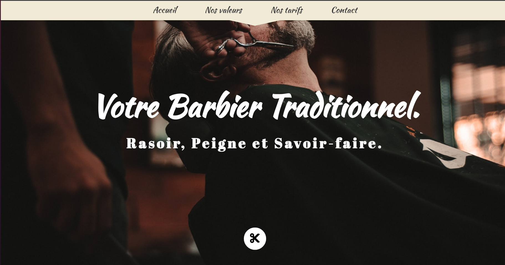

<h1 align="center">Barber Site</h1>

   A French front web development tutorial from <a href="https://www.udemy.com/" target="_blank">Udemy</a>

  <h3>
    <a href="https://barber-site.web.app/">
      Website
    </a>

<!-- TABLE OF CONTENTS -->

## Table of Contents

- [Overview](#overview)
- [Built With](#built-with)

<!-- OVERVIEW -->

## Overview

### Built With

<!-- This section should list any major frameworks that you built your project using. Here are a few examples.-->

- [HTML](https://html.com/)
- [CSS](https://www.w3.org/Style/CSS/Overview.en.html)
- [JS](https://www.javascript.com/)
- [JQuery](https://jquery.com/)
